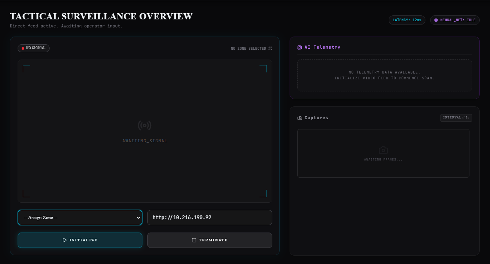
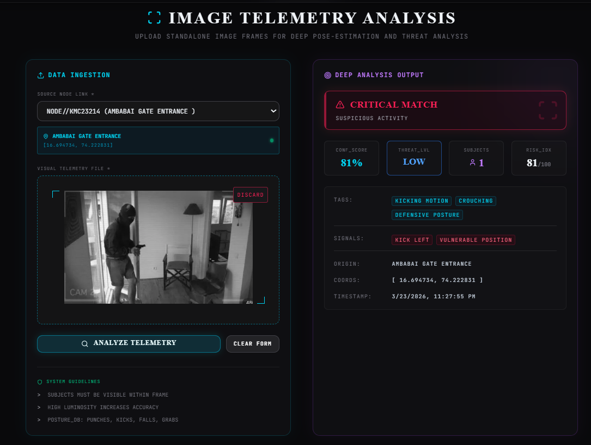
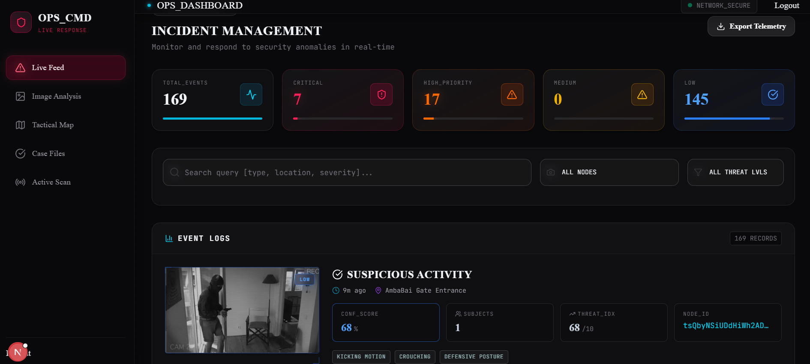

# AI-Embedded Crime Detection System 🛡️👁️‍🗨️

A highly advanced, AI-powered crime detection and surveillance network. This system is designed to provide real-time Threat Level tracking, anomaly detection, and automated incident reporting through a multi-node camera network, utilizing a sleek, high-tech "command center" interface.

## 🚀 Key Features

*   **Real-time AI Video Surveillance:** Deep pose estimation via YOLOv8 to detect violence (punches, kicks, falls, weapons).
*   **High-Tech Command Center UI:** A stunning, immersive dark-mode grid aesthetic utilizing Glassmorphism, neon highlights, and Framer Motion animations.
*   **Live Node Telemetry:** Connects seamlessly with ESP32-CAM networks for direct IP stream ingestion.
*   **Automated Incident Queue:** Anomalous events are captured instantly and pushed to the operator dashboard with auto-calculated Threat Levels and Risk Indices.
*   **Geographic Fleet Tracking:** Interactive radar maps to monitor active and offline camera nodes globally via Leaflet.
*   **Role-Based Access Control:** Secure Admin vs. Operator views via Firebase Authentication.

---

## 📸 Dashboard Overview

*(Note: Please save the images you provided into a folder named `assets/` in your repository root with the filenames below, or update the paths to match where you upload them!)*

### 1. Tactical Surveillance Feed


### 2. Deep Image Telemetry Analysis


### 3. Incident Management & Logs


---

## 🏗️ System Architecture

The project utilizes a distinct microservices architecture split into three main components:

```text
AI-Embedded-Crime-Detection-System/
├── frontend/           # Next.js Command Center User Interface
├── backend/            # Node.js/Express API & Firebase Realtime DB bridging
└── ai-server/          # Python AI inference engine (YOLOv8 & OpenCV)
```

### 1. Frontend (Command Center GUI)
Built for rapid situational awareness. The frontend acts as the operator's primary HUD (Heads Up Display).
*   **Framework:** Next.js (React)
*   **Styling:** Tailwind CSS (Custom Dark HUD Theme), Framer Motion, Lucide Icons
*   **Mapping & Charts:** React-Leaflet, Recharts

### 2. Backend (Node API Server)
The secure middle-layer funneling telemetry and data storage.
*   **Framework:** Node.js, Express.js
*   **Database:** Firebase Firestore & Firebase Auth
*   **Features:** Hardware node provisioning, image handling, JWT processing

### 3. AI Server (Nexus Detection Engine)
The computational brain analyzing visual inputs.
*   **Framework:** Python, Flask, OpenCV
*   **Models:** Ultralytics YOLOv8 pose-estimation networks
*   **Capabilities:** Frame-by-frame live analysis and standalone high-resolution image telemetry scanning.

---

## ⚙️ Installation & Setup

### Prerequisites
*   Node.js (v18+)
*   Python 3.10+
*   Firebase Account credentials

### 1. Clone the Repository
```bash
git clone https://github.com/Abhikhomane45/AI-Embedded-Crime-Detection-System.git
cd AI-Embedded-Crime-Detection-System
```

### 2. Frontend Configuration
```bash
cd frontend
npm install
```
Create a `.env.local` inside `/frontend` with your Firebase config:
```env
NEXT_PUBLIC_FIREBASE_API_KEY="your_api_key"
NEXT_PUBLIC_FIREBASE_AUTH_DOMAIN="your_domain"
NEXT_PUBLIC_FIREBASE_PROJECT_ID="your_project_id"
NEXT_PUBLIC_FIREBASE_STORAGE_BUCKET="your_bucket"
NEXT_PUBLIC_FIREBASE_MESSAGING_SENDER_ID="your_sender_id"
NEXT_PUBLIC_FIREBASE_APP_ID="your_app_id"
```
Run Server: `npm run dev`

### 3. Backend Configuration
```bash
cd backend
npm install
```
Place your Firebase Admin SDK service account key as `serviceAccountKey.json` inside the `backend` folder.
Run Server: `npm run dev` (Runs on Port 5000)

### 4. AI Server Configuration
```bash
cd ai-server
pip install -r requirements.txt
```
Run AI Engine: `python image_detector.py` (Runs on Port 8000)

*Note: The YOLOv8 `.pt` models are tracked via Git LFS due to size.*

---

## 📡 Hardware Integration (ESP32-CAM)
This system natively supports ESP32 microcontrollers for streaming.
1. Flash the ESP32-CAM with a standard HTTP MJPEG stream sketch.
2. In the Admin Dashboard `> Cameras`, map the node with its IP.
3. Live feeds will instantly appear in the `Surveillance Center` with continuous AI tracking logic applied.

---

## 🧑‍💻 Authors & Contributors
*   **Abhijeet Khomane** — GitHub: [@Abhikhomane45](https://github.com/Abhikhomane45)
*   **Shubham Gavade** — Project Building and Development Contributions
 &
## 📄 License
This system is licensed under the MIT License. Designed for rapid deployment in smart-city infrastructure and localized security grids. Ensure compliance with regional surveillance privacy laws.
